# Design Document: RAG Application with LangChain, Higress, and Elasticsearch

## Overview

This design describes a RAG (Retrieval Augmented Generation) application that combines LangChain for document processing, Elasticsearch for vector storage and hybrid search, and Higress AI Gateway for LLM integration. The system enables intelligent question-answering by retrieving relevant context from a knowledge base before generating responses.

The architecture follows a two-phase approach:
1. **Data Preprocessing Phase**: Parse documents, generate embeddings, and index into Elasticsearch
2. **Query Phase**: Retrieve relevant context via hybrid search and generate LLM responses

## Architecture

```mermaid
flowchart TB
    subgraph Preprocessing["Data Preprocessing Phase"]
        MD[Markdown Document] --> Splitter[MarkdownHeaderTextSplitter]
        Splitter --> Chunks[Document Chunks]
        Chunks --> RecordMgr[SQLRecordManager]
        RecordMgr --> ESStore[ElasticsearchStore]
        ESStore --> ES[(Elasticsearch)]
        ES --> ELSER[ELSER v2 Model]
        ELSER --> SparseVec[Sparse Vectors]
    end

    subgraph Query["Query Phase"]
        User[User Query] --> Higress[Higress AI Gateway]
        Higress --> AISearch[ai-search Plugin]
        AISearch --> HybridSearch[Hybrid Search RRF]
        HybridSearch --> ES2[(Elasticsearch)]
        ES2 --> Context[Retrieved Context]
        Context --> Prompt[Prompt Generation]
        Prompt --> LLM[LLM Provider]
        LLM --> Response[Generated Response]
        Response --> User
    end
```



## Components and Interfaces

### 1. Infrastructure Components

#### Docker Compose Stack
- **Elasticsearch**: Version 8.x with ML capabilities enabled
  - Port: 9200 (API), 9300 (cluster)
  - Authentication: elastic/test123
  - SSL: Enabled with self-signed certificates
- **Kibana**: Management UI
  - Port: 5601
  - Connected to Elasticsearch

#### Higress AI Gateway
- **Console**: Port 8001
- **API Endpoint**: Port 8080
- **Plugins**: ai-search for RAG capabilities

### 2. Document Processing Components

#### MarkdownHeaderTextSplitter (LangChain)
```python
interface MarkdownSplitterConfig:
    headers_to_split_on: List[Tuple[str, str]]  # e.g., [("#", "Header 1"), ("##", "Header 2")]
    strip_headers: bool  # Whether to remove headers from content
```

#### SQLRecordManager (LangChain)
```python
interface RecordManager:
    namespace: str  # e.g., "elasticsearch/{index_name}"
    db_url: str     # SQLite connection string
    
    def create_schema() -> None
    def index(docs, cleanup_mode) -> IndexResult
```

#### ElasticsearchStore (LangChain)
```python
interface ElasticsearchStoreConfig:
    es_connection: Elasticsearch
    index_name: str
    query_field: str  # Field for text content
    strategy: SparseVectorStrategy
```

### 3. Search Components

#### Hybrid Search Query Structure
```json
{
  "_source": {
    "excludes": "semantic_text"
  },
  "retriever": {
    "rrf": {
      "retrievers": [
        {
          "standard": {
            "query": {
              "match": {
                "content": "<query>"
              }
            }
          }
        },
        {
          "standard": {
            "query": {
              "semantic": {
                "field": "semantic_text",
                "query": "<query>"
              }
            }
          }
        }
      ]
    }
  }
}
```

### 4. AI Gateway Components

#### ai-search Plugin Configuration
```yaml
searchFrom:
  - type: "elasticsearch"
    serviceName: "<service_name>"
    username: "elastic"
    password: "<password>"
    index: "<index_name>"
    contentField: "content"
    semanticTextField: "semantic_text"
```

## Data Models

### Elasticsearch Index Mapping
```json
{
  "mappings": {
    "properties": {
      "semantic_text": {
        "type": "semantic_text"
      },
      "content": {
        "type": "text",
        "copy_to": "semantic_text"
      }
    }
  }
}
```

### Document Chunk Model
```python
@dataclass
class DocumentChunk:
    page_content: str           # The text content of the chunk
    metadata: Dict[str, str]    # Header hierarchy metadata
```

### Index Result Model
```python
@dataclass
class IndexResult:
    num_added: int
    num_updated: int
    num_skipped: int
    num_deleted: int
```

## Correctness Properties

*A property is a characteristic or behavior that should hold true across all valid executions of a system-essentially, a formal statement about what the system should do. Properties serve as the bridge between human-readable specifications and machine-verifiable correctness guarantees.*

Based on the prework analysis, the following correctness properties have been identified:

### Property 1: Document Round-Trip Consistency
*For any* valid document chunk, serializing it to Elasticsearch and then retrieving it should return content equivalent to the original document's page_content.
**Validates: Requirements 4.5, 4.6**

### Property 2: Markdown Header Splitting Preserves Content
*For any* valid Markdown document with headers, splitting by headers and then concatenating all chunks should produce content that contains all non-header text from the original document.
**Validates: Requirements 4.1**

### Property 3: Deduplication Idempotence
*For any* set of documents, indexing the same documents twice with the same RecordManager should result in num_added=0 and num_skipped=N on the second indexing (where N is the document count).
**Validates: Requirements 4.2**

### Property 4: Full Cleanup Consistency
*For any* initial set of documents A and updated set B, after indexing A then indexing B with cleanup="full", the index should contain exactly the documents in B.
**Validates: Requirements 4.4**

### Property 5: Search Results Exclude Semantic Field
*For any* search query executed with the custom_query function, all returned results should not contain the semantic_text field in their source.
**Validates: Requirements 5.3**

### Property 6: Copy-To Field Population
*For any* document written to the content field, the semantic_text field should be automatically populated with the same content (verified via Elasticsearch's internal processing).
**Validates: Requirements 3.3**

## Error Handling

### Elasticsearch Connection Errors
- Retry with exponential backoff for transient failures
- Log connection errors with full context
- Fail fast if Elasticsearch is unreachable after retries

### Document Processing Errors
- Skip malformed documents and log warnings
- Continue processing remaining documents
- Report skipped documents in the final result

### Search Errors
- Return empty results with error message for search failures
- Log query details for debugging
- Handle timeout errors gracefully

### LLM API Errors
- Higress handles provider failover automatically
- Return appropriate error messages to users
- Log API errors for monitoring

## Testing Strategy

### Property-Based Testing Framework
- **Library**: Hypothesis (Python)
- **Minimum iterations**: 100 per property test
- **Test annotation format**: `**Feature: rag-langchain-higress-es, Property {number}: {property_text}**`

### Unit Tests
Unit tests will cover:
- Markdown splitting with various header combinations
- Elasticsearch connection and index creation
- Custom query builder function
- Configuration validation

### Integration Tests
Integration tests will verify:
- End-to-end document indexing pipeline
- Hybrid search with RRF ranking
- Higress ai-search plugin integration
- RAG query flow with actual LLM responses

### Test Data
- Sample Markdown documents with various header structures
- Employee handbook document from the article
- Edge cases: empty documents, documents without headers, deeply nested headers
